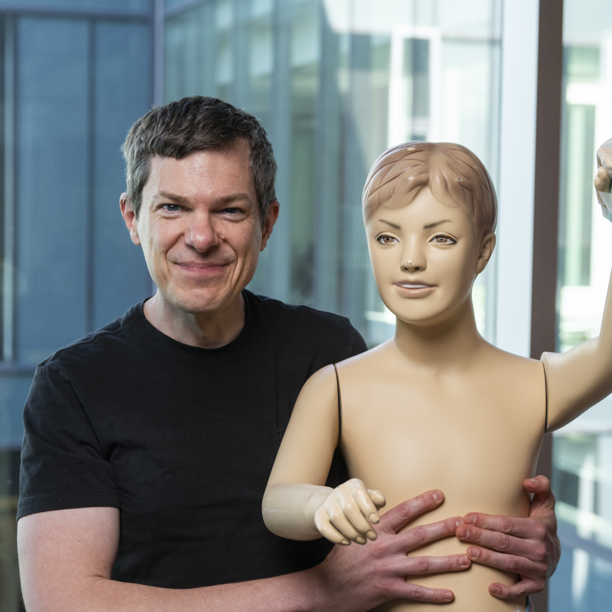
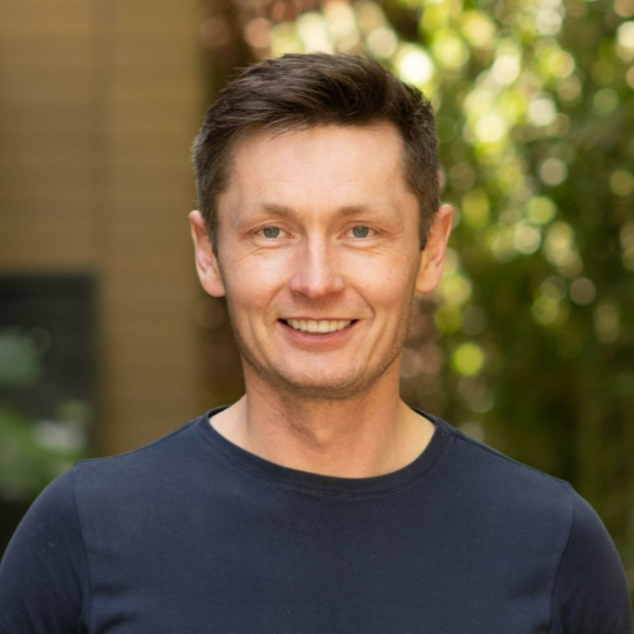

## Overview

**A workshop on agent-first data systems, agents for data science and analytics, and the future of data systems (part of [CAIS 2026](https://www.caisconf.org/), The ACM Conference on AI and Agentic Systems, May 26, 2026, San Jose, California)**

Today's data systems were designed for a small number of careful human operators. But a growing share of analytics, data engineering, and ML workflows is increasingly being delegated to AI agents. This workshop will bring together researchers and practitioners to study how data systems should evolve for agents, and how agents themselves can help shape better systems.

The workshop is born out of recent work in [data](https://arxiv.org/pdf/2509.00997) [management](https://arxiv.org/abs/2511.16402), but generalizes to other directions at the intersection of data and agents. Our goal is to explore the full design space where **data systems and AI agents meet**, and we are open to creative interpretations of the theme.

  <strong>🍻 Join the happy hour!</strong> Awards, drinks, and networking with speakers, PC members, and attendees continue after the workshop — sponsored by our partners. <a href="https://luma.com/4v94jpzz?tk=zBTIdz" target="_blank"><strong>Save your spot →</strong></a>

- [Organizers](#organizers)
- [Invited Speakers](#invited-speakers)
- [Awards](#awards)
- [Panel](#panel)
- [Program](#program-tentative)
- [Important Dates](#important-dates)
- [Call for Papers](#call-for-papers)
- [Accepted Papers](#accepted-papers)
- [Contact](#contact)

### Sponsors

  
  
  
  

## Organizers

<table>
  <tr>
    <td align="center" width="33%">
        
      <strong>Elaine Ang</strong> 
      <em>Columbia University</em>
    </td>
    <td align="center" width="33%">
        
      <strong>Shu Liu</strong> 
      <em>UC Berkeley</em>
    </td>
    <td align="center" width="33%">
        
      <strong>Aditya Parameswaran</strong> 
      <em>UC Berkeley</em>
    </td>
  </tr>
  <tr>
    <td align="center" width="33%">
        
      <strong>John Dickerson</strong> 
      <em>Mozilla AI</em>
    </td>
    <td align="center" width="33%">
        
      <strong>Jonathan Frankle</strong> 
      <em>Databricks</em>
    </td>
    <td align="center" width="33%">
        
      <strong>Jacopo Tagliabue</strong> 
      <em>Bauplan Labs</em>
    </td>
  </tr>
</table>

---

## Invited Speakers

<table>
  <tr>
    <td align="center" width="33%">
        
      <strong>Andy Pavlo</strong> (left) 
      <em>Carnegie Mellon University</em>
    </td>
    <td align="center" width="33%">
        
      <strong>Aaron Katz</strong> 
      <em>ClickHouse</em>
    </td>
    <td align="center" width="33%">
        
      <strong>Nikita Shamgunov</strong> 
      <em>Neon / Databricks</em>
    </td>
  </tr>
</table>

### Speaker bios

**Andy Pavlo** — Andy Pavlo is an Associate Professor with Indefinite Tenure of Databaseology in the Computer Science Department at Carnegie Mellon University. His (unnatural) infatuation with database systems has inadvertently caused him to incur several distinctions, such as IEEE TCDE Ramez Elmasri Outstanding Database Education Award (2026), VLDB Early Career Award (2021), NSF CAREER (2019), Sloan Fellowship (2018), and the ACM SIGMOD Jim Gray Best Dissertation Award (2014). He also was the CEO & co-founder of the OtterTune database tuning start-up (2020-2024), but it died an untimely death. He is currently the CEO and co-founder of "SO-YOU-DONT-HAVE-TO INCORPORATED'); DROP TABLE companies; --" (2025-). Andy earned his Ph.D. in 2013 at Brown University under Stan Zdonik and Mike Stonebraker. He knows some pile about databases.

**Aaron Katz** — Aaron Katz is currently Co-Founder and CEO of ClickHouse, Inc., the company behind ClickHouse, the industry-leading online analytical processing database management system. With more than 20 years of experience building and leading global teams, Aaron brings a unique perspective with a focus on international business, scale, and distribution. Most recently, Aaron led the GTM efforts at Elastic (NYSE: ESTC) between 2014 and 2020 where he helped grow the company from ~$5M in revenue when he joined to >$500M in revenue as a Section 16 officer when he left. Prior to Elastic, Aaron spent 12 years (2002 - 2014) at salesforce.com (NYSE: CRM) where he held a variety of international sales leadership roles and helped grow the company from a private, ~200 employee startup to a >$200B market leader. Aaron holds a Bachelor's of Science degree in Managerial Economics from the University of California, Davis and lives in the San Francisco Bay Area with his wife and two children.

**Nikita Shamgunov** — Nikita Shamgunov is a database systems entrepreneur and engineer, and the co-founder and CEO of Neon, the serverless Postgres company acquired by Databricks in 2025. Before Neon, he co-founded SingleStore, formerly MemSQL, where he served as founding CTO and then CEO, helping build a distributed SQL database for real-time operational and analytical workloads. Earlier in his career, he worked on SQL Server at Microsoft and was a senior engineer at Facebook. Across two decades in database infrastructure, he has worked on systems spanning on-prem engines, distributed SQL, cloud-native databases, and serverless Postgres — and now sits at the intersection of databases and AI-agent workloads.

---

## Awards

We are pleased to offer awards for outstanding contributions:

- **MongoDB Best Paper Award** — $1,000, recognizing the strongest accepted contribution to the workshop.
- **Datadog Best Student Paper Award** — $1,000, for the best paper with a student as the primary author.

Awards will be presented at the end of the day during a [social gathering](https://luma.com/4v94jpzz) with drinks and informal discussion — [register for the happy hour](https://luma.com/4v94jpzz) to save your spot!

---

## Panel

The workshop will conclude with a panel discussion bringing together different perspectives on agentic data systems, from infrastructure and optimization to safety and deployment. The panel will be moderated by [Ciro Greco](https://www.linkedin.com/in/cirogreco/).

<table>
  <tr>
    <td align="center" width="25%">
        
      <strong>Ashish Kumar</strong> 
      <em>MongoDB</em>
    </td>
    <td align="center" width="25%">
        
      <strong>Anant Jhingran</strong> 
      <em>IBM Software</em>
    </td>
    <td align="center" width="25%">
        
      <strong>Junaid Ahmed</strong> 
      <em>Datadog</em>
    </td>
    <td align="center" width="25%">
        
      <strong>Anupam Datta</strong> 
      <em>Snowflake</em>
    </td>
  </tr>
</table>

### Panelist bios

**Ashish Kumar** — Ashish Kumar is a Technical Fellow at MongoDB, where he focuses on architectural improvements across the company's product offerings. He joined MongoDB through the acquisition of Grainite, where he was Co-Founder and CEO. At Grainite, he led the development of a first-of-its-kind transactional database unifying native stream storage and parallel processing. Previously, Ashish spent 11 years as a Senior Engineering Director at Google, most recently leading the teams responsible for BigTable, Spanner, Datastore, and Firestore. During his tenure at Google, he also managed teams across Hardware, Display Ads, and Developer Tools. Earlier in his career, Ashish held executive roles at Sun Microsystems and infrastructure startups. He holds a Bachelor's in Business from SRCC, Delhi University.

**Anant Jhingran** — Anant Jhingran is CTO for IBM Software, a role he took on when StepZen — the GraphQL API company he co-founded and led as CEO — was acquired by IBM in February 2023. Before StepZen, he helped take Apigee public and through its acquisition by Google. Earlier at IBM, he was an IBM Fellow and CTO of the Information Management Division, shipping products that generated billions in revenue across IBM and Apigee. He holds a PhD in database systems from UC Berkeley and is a Distinguished Alumnus of IIT Delhi, with over a dozen patents and 20+ technical papers to his name.

**Junaid Ahmed** — Junaid Ahmed is Vice President of Engineering at Datadog, where he leads the Applications pillars of Observability including several AI efforts and helping evolve Datadog's offering for the agentic future. Before Datadog, he held senior engineering leadership roles as Director of Engineering at Apple and General Manager at Microsoft, working on large-scale problems in search, advertising, recommendations, and deep learning. He is the co-author of several papers including research on "Approximate Nearest Neighbor methods for Dense Text Retrieval" (ICLR 2021) and holds 20+ patents in search ranking, content understanding, and neural information retrieval. Junaid studied at the University of Washington.

**Anupam Datta** — Anupam Datta is Principal Research Scientist and Snowflake AI Research Lead at Snowflake, which he joined through the acquisition of TruEra in 2024. He was Co-Founder and Chief Scientist of TruEra from 2019 to 2024, building tools for trustworthy AI evaluation and observability. Before TruEra, Anupam was a tenured Professor of Electrical & Computer Engineering and Computer Science at Carnegie Mellon University from 2007 to 2022, where he remains an Adjunct Professor; his research spans trustworthy AI, including evaluation, explainability, fairness, and robustness of ML and GenAI systems. He holds a Ph.D. and M.S. in Computer Science from Stanford University and a B.Tech. in Computer Science and Engineering from IIT Kharagpur.

---

## Program (Tentative)

**May 26, 2026 — In person in San Jose, California. The schedule below is subject to change.**

| Time | Activity | Details |
|---|---|---|
| 1:30 – 1:40 PM | Welcome | Introductory remarks |
| 1:40 – 2:20 PM | Keynote | Aaron Katz |
| 2:20 – 3:00 PM | Keynote | Andy Pavlo |
| 3:00 – 3:30 PM | Break | Coffee break |
| 3:30 – 4:30 PM | Contributions | Lightning talks |
| 4:30 – 5:10 PM | Keynote | Nikita Shamgunov |
| 5:10 – 6:00 PM | Panel & closing | Moderated by [Ciro Greco](https://www.linkedin.com/in/cirogreco/) |
| 6:30 PM - ? | [Happy hour, drinks, and awards](https://luma.com/4v94jpzz) | [Register here](https://luma.com/4v94jpzz) |

---

## Important Dates

| Milestone | Date |
|---|---|
| ~~Submission deadline~~ | ~~Tue, May 5, 2026~~ |
| ~~Accept / reject notification~~ | ~~Mon, May 11, 2026~~ |
| ~~Camera-ready~~ | ~~Sun, May 17, 2026~~ |
| Workshop | Tue, May 26, 2026 |

---

## Call for Papers

We invite submissions on the emerging intersection of **AI agents** and **data systems**. Drawing from the workshop [manifesto](papers/CAIS_2026_workshop_online.pdf), we are mainly interested in contributions along these research directions:

1. **Productionizing agentic workloads.** Capturing the nuances of agentic reasoning and engineering techniques across the entire data lifecycle.
2. **Optimizing agent semantics.** Exploring the transition from deterministic SQL execution to agent-driven pipelines.
3. **Data systems for agents.** Rethinking core system guarantees from the ground up to support non-human workloads.
4. **Agents for system design.** Exploring the "self-driving" potential of the stack, where agents autonomously design, tune, and maintain the very infrastructure they inhabit.

Examples of topics include, but are not limited to:

- Agent-first OLAP architectures for safe, reproducible, and cost-efficient analytics
- Agentic analytics workflows, including human-in-the-loop patterns and production failure modes
- Evaluation methodologies, benchmarks, and workload traces for data agents
- LLM-assisted optimization and tuning for data systems
- War stories and postmortems from production deployments
- Agentic workflows for data engineering and data science
- Operational reliability for agent-driven automation, including observability, guardrails, governance, and cost controls
- Work-in-progress and early-stage results that showcase novel ideas or promising directions, even if not yet fully evaluated

### Submission formats

We solicit:

- **Short research and position papers**: up to 4 pages plus references
- **Late-breaking results / extended abstracts**: up to 2 pages plus references

All submissions must use the [ACM sigconf double-column format](https://www.acm.org/publications/proceedings-template).

Submissions are reviewed in a **single-blind** process by members of the committee. We welcome overlapping submissions with other venues (SAO is non-archival). For more background, recent relevant literature, and inspiring use cases, see our [workshop proposal](papers/CAIS_2026_workshop_online.pdf).

### Program Committee

- **Aldrin Montana** — Bauplan Labs
- **Alperen Keleş** — University of Maryland
- **Bonnie Xu** — OpenAI
- **Davide Eynard** — Mozilla AI
- **Eugene Wu** — Columbia University
- **Federico Bianchi** — Together AI
- **Gaetano Rossiello** — IBM
- **Joseph Axisa** — Google
- **Nandana Mihindukulasooriya** — IBM
- **Nicole Rose Schneider** — University of Maryland
- **Sesh Nalla** — Datadog
- **Stephanie Wang** — MongoDB
- **Tao Ye** — Lyft
- **Till Döhmen** — MotherDuck

---

## Accepted Papers

The program features contributions from leading academic and industry organizations, including Stanford, Columbia, NVIDIA, CoreWeave, IBM, MongoDB, Databricks, Bauplan, and many others.

- **A Case for Simulation-Driven Resilience in Agent-First Data Systems** [(paper)](papers/9.pdf)  
  <small>Aleksey Charapko, Murat Demirbas, Akshat Vig</small>
- **A Query Engine for the Agents** [(paper)](papers/8.pdf)  
  <small>Kenny Daniel</small>
- **Agents for Data Streaming Tasks: The Missing Pieces** [(paper)](papers/16.pdf)  
  <small>Shreesha Gopalakrishna Bhat, Landon Johnson, Michael Noguera, Aishwarya Ganesan, Ramnatthan Alagappan</small>
- **Autonomous Agent Learning in Production** [(paper)](papers/86.pdf)  
  <small>Xinhao Cheng, Patrick Coppock, Jianan Ji, Zhihao Jia, Vasilis Kypriotis, Dimitrios Skarlatos, Eliot Solomon, Zhihao Zhang, Yu Zhou</small>
- **Beyond Semantic Similarity: Performance and Costs of Agentic Retrieval for Complex Tasks** [(paper)](papers/71.pdf)  
  <small>Reza Esfandiarpoor, Radek Osmulski, Yauhen Babakhin, Gabriel de Souza P. Moreira, Oliver Holworthy, Jie He, Ronay Ak, Jiarui Cai, Ryan Chesler, Bo Liu, Even Oldridge</small>
- **Beyond the Shell: Extending Agents with Reactive Python Notebooks** [(paper)](papers/45.pdf)  
  <small>Trevor Manz, Myles Scolnick, Akshay Agrawal</small>
- **BranchBench: An Extensible Benchmark for Agentic Database Branching** [(paper)](papers/37.pdf)  
  <small>Elaine Ang, Sam Weldon, In Keun Kim, Kevin Durand, Kostis Kaffes, Eugene Wu</small>
- **Colloquy (cq): Sharing Failure Modes to Help Agents** [(paper)](papers/89.pdf)  
  <small>Peter Wilson, Daniel Nissani</small>
- **Data Journalist Agent: Transforming Data into Trustworthy Multimodal Story** [(paper)](papers/2.pdf)  
  <small>Kevin Qinghong Lin, Batu EI, Yuhong Shi, Pan Lu, Philip Torr, James Zou</small>
- **Discovery Agents for Real-Time Analytics: Toward Proactive Insight Systems** [(paper)](papers/95.pdf)  
  <small>Gaetano Rossiello, Dharmashankar Subramanian</small>
- **Grounding Agent-Driven Code Optimization in Production Telemetry** [(paper)](papers/31.pdf)  
  <small>Piotr Bejda, Junaid Ahmed</small>
- **Lumilake: An Agentic Analytics Engine for AI4Science** [(paper)](papers/84.pdf)  
  <small>Zhengyuan Su, Noppanat Wadlom, Junyi Shen, Yicong Huang, Wentao Wu, Yao Lu</small>
- **Metaxy: Field-Level Metadata Management for Incremental Multimodal ML Pipelines** [(paper)](papers/6.pdf)  
  <small>Daniel Gafni, Georg Heiler</small>
- **Modular Monoliths: Agentic Analytical Database Architecture** [(paper)](papers/23.pdf)  
  <small>Giuseppe Mazzotta, SJ Saidi, Mosha Pasumansky, Benjamin Wagner</small>
- **Parsing Is Not Executing: Decentralized Compliance for Agentic Query Plan Routing** [(paper)](papers/42.pdf)  
  <small>Ranjan Sinha</small>
- **Querying Everything Everywhere All at Once** [(paper)](papers/69.pdf)  
  <small>Jacopo Tagliabue, Aldrin Montana</small>
- **Sophrosyne: Agentic Exploration of Relational Data Systems Needs Moderation** [(paper)](papers/81.pdf)  
  <small>Madhav Jivrajani, Ramnatthan Alagappan, Aishwarya Ganesan</small>
- **TexeraAgent: An AI-Agent for Data Science Using Dataflows** [(paper)](papers/48.pdf)  
  <small>Jiadong Bai, Yicong Huang, Chen Li</small>
- **The Hydration Proxy Pattern: Architecting Conversational Data Systems for Stateless LLM APIs** [(paper)](papers/85.pdf)  
  <small>Joseph Axisa</small>
- **The Importance of Out-of-Band Metadata for Safe Autonomous Agents: The Redpanda Agentic Data Plane** [(paper)](papers/18.pdf)  
  <small>Tyler Akidau, Tyler Rockwood, Johannes Brüderl, Marc Millstone</small>
- **Towards a Context Layer for Self-Improving Data Agents** [(paper)](papers/73.pdf)  
  <small>Till Döhmen, Jacob Matson, Jordan Tigani</small>
- **When Agents Outgrow RAG: Building Production Retrieval Systems in the Lakehouse** [(paper)](papers/87.pdf)  
  <small>Chang She, Prashanth Rao</small>
- **Workflow, Not Prose: A Multi-Agent Methodology for Data Agent** [(paper)](papers/28.pdf)  
  <small>Chia-liang Kao, Kent Huang</small>

---

## Contact

For questions, please contact:

**Jacopo Tagliabue**  
jacopo.tagliabue@bauplanlabs.com

**Elaine Ang**  
ra3448@columbia.edu